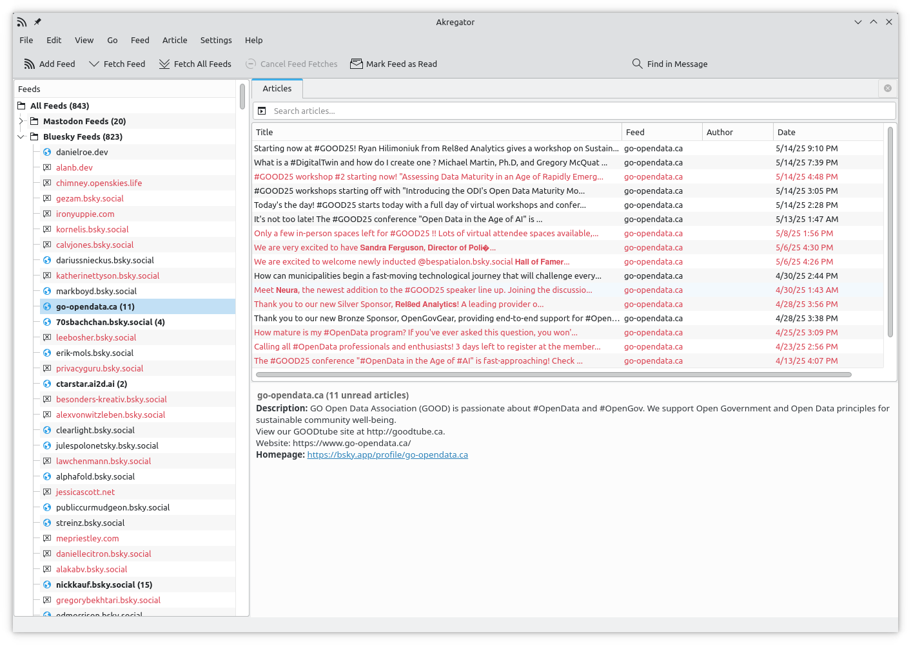

# atp2rss

A small toolkit to convert AT Protocol (AT) and ActivityPub (AP) subscription lists into RSS feeds in OPML format. 

## Description

The toolkit consists of two Python scripts that convert follow lists from Bluesky and Mastodon respectively into OPML files that can be imported into any RSS reader. 

This way you can keep track of posts from accounts that post infrequently and might get lost in the default "timeline" interface of these platforms.

## How to use

* Clone or fork this repository in your computer
* Export your follow lists from Bluesky and/or the Mastodon instance you have an account on (detailed instructions below)
* The scripts work independently, generating two separate OPML files.
* Run **python3 at.py**. This creates the OPML file _bluesky_feeds.opml_ in the data directory. NB: it may take a while as it makes internet queries to resolve the id's
* Run **python3 ap.py** inside the cloned repo. This creates the OPML file _mastodon_feeds.opml_ in the data directory
 for a long list as it needs to resolve the names of feeds from an online service.
* Import these two feeds into your favorite reader(s).
* Done!

## Exporting files

### Bluesky

On the web interface of Bluesky:

* Settings -> Accounts -> Download CAR file
* This downloads a file named repo.car to the default directory of your browser
* Move the repo.car file to the atp2rss/data directory

### Mastodon

On the web interface of your Mastodon instance:

* Settings -> Import and Export -> Follows (CSV)
* This downloads a file named following_accounts.csv to the default directory of your browser
* Move the following_accounts.csv file to the atp2rss/data directory

### YouTube

On the web interface of your YouTube account

* Follow instructions for a takeout and export your data
* Make sure to select only subscriptions
* This will eventually download a file named takeout-XXXX.zip to the default directory of your browser
* Move and unzip this file to the atp2rss/data directory. This will create a csv file

## Dependencies

To parse the AtProto export (CAR file) we need the atproto library (also needed for resolving did's).

## Troubleshooting

* On bluesky long lists may hit rate limits
* On mastodon various accounts may actually be federated from instances that do not provide RSS feeds